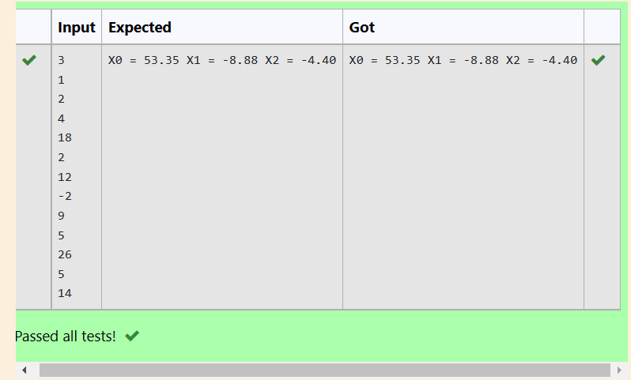

# Gaussian Elimination

## AIM:
To write a program to find the solution of a matrix using Gaussian Elimination.

## Equipments Required:
1. Hardware – PCs
2. Anaconda – Python 3.7 Installation / Moodle-Code Runner

## Algorithm
1. Import numpy library using import statement.
2. Import the sys module to use the built-in functions.
3. Get input from the user for number of rows and add it by 1 for number of columns.
4. Using np.zeros() set the matrix as null matrix
5. Using for loop get input from the user for each element in the matrix.
6. Using for loop we can perform the elementary row operations and find the final matrix.
7. Print the values by solving the matrix using for loop with 2 point precision.
8. End the program.

## Program:
```
import numpy as np
import sys
n = int(input())
a = np.zeros((n,n+1))
x= np.zeros(n)
for i in range(n):
    for j in range(n+1):
        a[i][j] = float(input())
for i in range(n):
    if a[i][i] == 0.0:
        sys.exit('Divide by zero detected')
    for j in range(i+1, n):
        ratio = a[j][i]/a[i][i]
        for k in range(n+1):
            a[j][k] = a[j][k] - ratio * a[i][k]
# Back Substitution
x[n-1] = a[n-1][n]/a[n-1][n-1]
for i in range(n-2,-1,-1):
    x[i] = a[i][n]
    for j in range(i+1,n):
        x[i] = x[i] - a[i][j]*x[j]
    x[i] = x[i]/a[i][i]
# Displaying Solution
for i in range(n):
    print('X%d = %0.2f' %(i,x[i]), end = ' ')
/*
Program to find the solution of a matrix using Gaussian Elimination.
Developed by: Ragul A C
RegisterNumber: 21500141
*/
```

## Output:



## Result:
Thus the program to find the solution of a matrix using Gaussian Elimination is written and verified using python programming.

